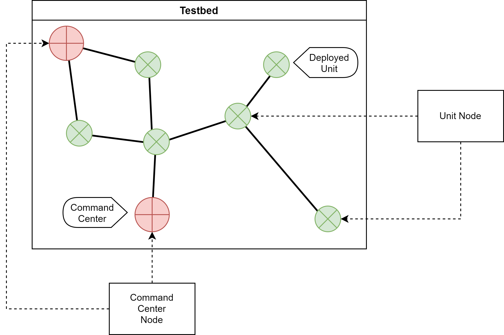
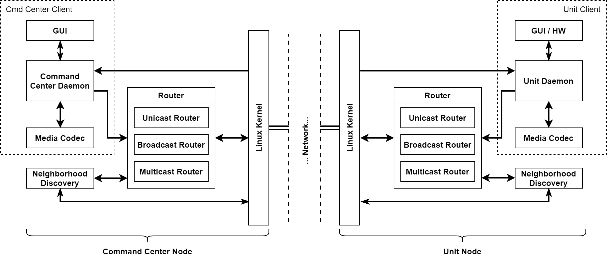

# C4IAN

Tactical Mobile ad-hoc network.
Build a network on the go for tactical teams in war and emeregency situations.

Supports video/audio streaming and messaging with unicast, multicast and broadcast cababilities.

## Problem Statement
Tactical teams face troubles to achieve scalable and reliable communications in the battlefield or during
emergencies due to the lack of a network infrastructure and the high mobility of units. They also need a
method to collect real time data and analyze it to have a competitive advantage in the battleground.

## Motivation
Mobile ad-hoc networks can be formed on-the-go, without any infrastructure. They promise more
flexibility and reliability than manual radio broadcasting. We are interested in building such complex
distributed systems.

## System Overview


## System Architecture


# Development
> Follow the rest of `README`s.

## Common Requirements
### golang 1.15.8
```
$ sudo apt update && sudo apt install -y wget && (
    set -e
    cd /tmp
    wget -c https://golang.org/dl/go1.15.8.linux-amd64.tar.gz
    tar xvf go1.15.8.linux-amd64.tar.gz
    sudo chown -R root:root ./go
    sudo mv go /usr/local
    mkdir -p $HOME/.config/go/1.15/{bin,pkg,src}
    echo >>"$HOME"/.bash_profile
    echo 'export GOPATH="$HOME/.config/go/1.15"' >>"$HOME"/.bash_profile
    echo 'export PATH="$PATH:/usr/local/go/bin:$GOPATH/bin"' >>"$HOME"/.bash_profile
    echo >>"$HOME"/.bash_profile
    . "$HOME"/.bash_profile
)
```
For `VSCode` support:
- Install [Go Extension](https://marketplace.visualstudio.com/items?itemName=golang.go).
- Install all then extension's recommended tools.
- Add `"go.gopath": "~/.config/go/1.15/"` to your `VSCode` settings.json file to enable `Go` extension tools.
- Open each golang project in its own `VSCode` session, e.g. `$ code src/router` to be able to use linter and gopls.

### yarn
### nodejs

## Issues
- `electron: error while loading shared libraries: libgconf-2.so.4: cannot open shared object file: No such file or directory`

[Solution] Run:
```
$ sudo apt install -y libgconf-2-4
```

## Daemonize
You need to use `systemd`/`runc` service to turn executable into a daemon.
